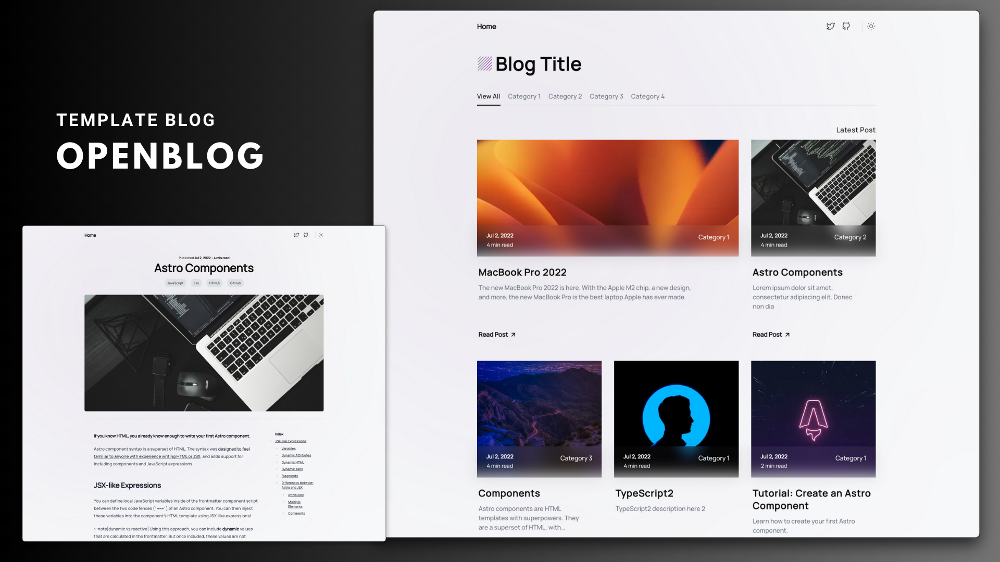

<div align="center">



<hr/>

<h3 align="center">
 ⭐ Leave a star if you like this project! ⭐️
</h3>

[](https://vercel.com/new/clone?repository-url=https%3A%2F%2Fgithub.com%2Fdanielcgilibert%2Fblog-template)
[](https://app.netlify.com/start/deploy?repository=https://github.com/danielcgilibert/blog-template)

</div>

## 📌 Table Of Contents

1. [Demo](#-Demo)
2. [CMS](#-Tina-CMS)
3. [Features](#-Features)
4. [Roadmap](#-Roadmap)
5. [Stack](#-Stack)
6. [Running locally](#-Running-Locally)
7. [Configure](#-Configure)
8. [Categories](#-Adding-a-category)
9. [Posts](#-Adding-a-post)
10. [Draft](#-Activating-draft-mode)
11. [FrontMatter](#-Frontmatter)
12. [CLI](#-Commands)
13. [Contributors](#-Contributors)

## 💻 Demo

Check out the [Demo](https://blog-template-gray.vercel.app/), hosted on Vercel
<br/>

https://github.com/danielcgilibert/blog-template/assets/44746462/56b8399e-cc5b-45a8-b9d2-d69833ecadb1

## 🦙 Tina CMS

By default, this template comes pre-configured with Tina CMS.

Now you can create your posts directly from the CMS without the need to do it manually.

If you decide to use Tina, it's not necessary to add any properties to the Markdown files, Tina does it automatically.

Example:

https://github.com/danielcgilibert/blog-template/assets/44746462/51ae324c-d383-40be-9b16-db159d1af15d

The documentation for Tina CMS can be found [here](https://tina.io/docs/)

> Tina is completely optional, and you can remove it, and it will still function in the same way.

## 💪 Features:

<p align="center">
  <a href="https://pagespeed.web.dev/analysis/https-blog-template-gray-vercel-app/7ovjfewos9?form_factor=mobile">
    
  <a>
</p>
    
- ✅ Minimal styling
- ✅ Mobile responsive
- ✅ 100/100 Lighthouse performance
- ✅ SEO-friendly with canonical URLs and OpenGraph data
- ✅ Sitemap support
- ✅ RSS Feed support
- ✅ Markdown & MDX support
- ✅ Syntax highlighting
- ✅ Image optimization
- ✅ Table of contents
- ✅ Dark mode
- ✅ Reading Time
- ✅ [Pagefind](https://pagefind.app/) static search library integration
- ✅ Related posts
- ✅ Share posts (Linkedin, twitter)
- ✅ Draft mode
- ✅ Copy code block
- ✅ CMS in the repository (Tina CMS)
- ✅ Pagination
- ✅ ViewTransition (new)

## 🛣️ Roadmap

- ❌ Add post author
- ❌ Add customization with colors
- ❌ Add filters for reading time, date...
- ❌ More sharing options
- ❌ Internationalization (i18n)

## ⚙️ Stack

- [**ASTRO** + **Typescript**](https://astro.build/) - Astro is the all-in-one web framework designed for speed.
- [**Tailwind CSS** + **Tailwind-Merge** + **clsx**](https://tailwindcss.com/) - Tailwind CSS is a utility-first CSS framework.
- [**Tabler Icons**](https://tabler-icons.io/i/) - A open source SVG icons.
- [**Eslint**](https://eslint.org/) - ESLint is an open source project that helps you find and fix problems.
- [**Prettier**](https://prettier.io/) - Code formatter.
- [**Search Library**](https://pagefind.app/) - Static search library integration.
- [**Motion**](https://motion.dev/) - Motion One is the smallest fully-featured animation library for the web.
- [**Tina CMS**](https://tina.io/) - CMS.

## 👨🏻‍💻 Running Locally

**Recommended extensions for VSCode:**

- [Tailwind CSS IntelliSense](https://marketplace.visualstudio.com/items?itemName=bradlc.vscode-tailwindcss).
- [Astro](https://marketplace.visualstudio.com/items?itemName=astro-build.astro-vscode).

1. Clone or [fork](https://github.com/danielcgilibert/blog-template/fork) the repository:

```bash
git@github.com:danielcgilibert/blog-template.git
```

2. Install dependencies:

```bash
pnpm install
```

3. Run the development server:

```bash
pnpm dev
```

## 📐 Configure

- Edit the configuration file **src/data/site.config.ts** for the basic blog metadata.
- Update the **astro.config.mjs** file at the root of the project with your own domain.
- Modify the files in the **/public** folder:
  - favicon
  - robots.txt -> update the Sitemap url to your own domain
  - open-graph -> the open-graph is the image that will be displayed when sharing the blog link. For posts, the preview image is the post cover.
- Edit the social networks in the Header component - **src/components/Header.astro**, change the URL to your social network.

## 🗂️ Adding a category

To add a new category to your blog, simply go to the src/data/categories.ts file and add it to the array.

Example:

```ts
export  const  CATEGORIES  =  [
'JavaScript',
'React',
'new category here'  <---
]  as  const
```

> 🚨 Zod checks whether the category is not correctly written or does not exist in the properties of the markdown document. **It will throw an error when building the application.** 🚨

## 📄 Adding a post

Adding a post is as simple as adding a .md or .mdx file to the blog folder at the path **src/content/blog**. The filename will be used to create the slug/URL of the page.

For example, if you have a file named **jsx-and-react.md**, it will be transformed into: **http://yourdomain.com/post/jsx-and-react/**

## 📝 Activating draft mode

To activate draft mode, add the property **draft: true** to the file, and it will no longer be displayed on the blog.

Example :

```ts
title: MacBook Pro 2022
description: 'The new MacBook Pro 2022 is here. With the Apple M2 chip, a new design, and more, the new MacBook Pro is the best laptop Apple has ever made.'
pubDate: 'Jul 02 2022'
heroImage: '../../assets/bg.jpg'
category: 'Category 1'
tags: ['JavaScript', 'css', 'HTML5', 'GitHub']
draft: true <---
```

## ⚡️ Frontmatter

## Required properties:

- Title
- Description
- pubDate
- heroImage (post cover)
- category (Choose a category from src/data/categories.ts)

## Optional properties:

- draft (no need to include it, by default it's false)
- tags

> The schema for posts is located at src/content/config.ts. You can modify any parameter, for example, by adding a maximum of 80 characters for titles: title: z.string().max(80).
> For more information, refer to the zod documentation.

## 🧞 Commands

All commands are run from the root of the project, from a terminal:

| Command                 | Action                                                                                                                           |
| :---------------------- | :------------------------------------------------------------------------------------------------------------------------------- |
| `pnpm install`          | Installs dependencies                                                                                                            |
| `pnpm run dev`          | Starts local dev server at `localhost:3000`                                                                                      |
| `pnpm run build`        | Build your production site to `./dist/`                                                                                          |
| `pnpm run preview`      | Preview your build locally, before deploying                                                                                     |
| `pnpm run format:check` | Check code format with Prettier                                                                                                  |
| `pnpm run format`       | Format codes with Prettier                                                                                                       |
| `pnpm run sync`         | Generates TypeScript types for all Astro modules. [Learn more](https://docs.astro.build/en/reference/cli-reference/#astro-sync). |
| `pnpm run lint`         | Lint with ESLint                                                                                                                 |

## 👋 Contributors

<a href="https://github.com/danielcgilibert/blog-template/graphs/contributors">
  
</a>
