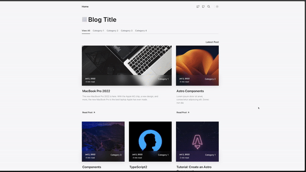

<div align="center">


<hr/>

[](https://vercel.com/new/clone?repository-url=https%3A%2F%2Fgithub.com%2Fdanielcgilibert%2Fblog-template)
[](https://app.netlify.com/start/deploy?repository=https://github.com/danielcgilibert/blog-template)

</div>

<h2 align="center">
  ⭐️ Leave a star if you like this project! ⭐️
</h2>

## 🔤 Readme Translations

- [**English**](https://github.com/danielcgilibert/blog-template/blob/main/README.md)
- [**Español**](https://github.com/danielcgilibert/blog-template/blob/main/README.es.md)

## 💻 Demo

Check out the [Demo](https://blog-template-gray.vercel.app/), hosted on Vercel
<br/>


## ⚙️ Stack

- [**ASTRO** + **Typescript**](https://astro.build/) - Astro is the all-in-one web framework designed for speed.
- [**Tailwind CSS** + **Tailwind-Merge** + **clsx**](https://tailwindcss.com/) - Tailwind CSS is a utility-first CSS framework.
- [**Tabler Icons**](https://tabler-icons.io/i/) - A open source SVG icons.

## ✅ Features:

- ✅ Minimal styling
- ✅ Mobile responsive
- ✅ 100/100 Lighthouse performance
- ✅ SEO-friendly with canonical URLs and OpenGraph data
- ✅ Sitemap support
- ✅ RSS Feed support
- ✅ Markdown & MDX support
- ✅ Syntax highlighting
- ✅ Image optimization
- ✅ Table of contents
- ✅ Dark mode
- ✅ Reading Time
- ✅ [Pagefind](https://pagefind.app/) static search library integration

## 🛣️ Roadmap

- ❌ Copy code block

## 🚀 Getting Started

**Recommended extensions for VSCode:**

- [Tailwind CSS IntelliSense](https://marketplace.visualstudio.com/items?itemName=bradlc.vscode-tailwindcss).
- [Astro](https://marketplace.visualstudio.com/items?itemName=astro-build.astro-vscode).

1. Clone or [fork](https://github.com/danielcgilibert/blog-template/fork) the repository:

```bash
git@github.com:danielcgilibert/blog-template.git
```

2. Install dependencies:

```bash
npm install
# or
yarn install
# or
pnpm install
```

3. Run the development server:

```bash
npm run dev
# or
yarn dev
# or
pnpm dev
```

## 🗂️ Project Structure

```
├── public/
├── src/
│   ├── assets/
│   ├── components/
│   ├── content/
│   ├── layouts/
│   ├── data/
│   ├── utils/
│   ├── styles/
│   └── pages/
├── astro.config.mjs
├── README.md
├── package.json
└── tsconfig.json
```

## 👋 Contributors

<a href="https://github.com/danielcgilibert/blog-template/graphs/contributors">
  
</a>
